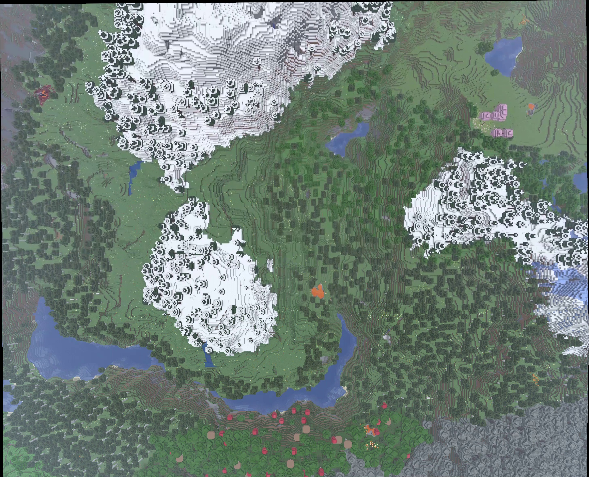

# Option 2: I’ll be Needin’ Stitches

Ground-school homework for UAVs@Berkeley: extract frames from a video and stitch them into one image using Python and OpenCV.



## Run

Tested with Python 3.12.3 on Linux.

From the repository root, enter the Week 2 folder before running commands:

```bash
cd week2
python3 -m venv .venv
source .venv/bin/activate
python -m pip install -r requirements.txt
```

Download the assignment video linked on slide 26 of *Software Ground School 2026 Week 2* and save it here as `flight.mp4`.

```bash
python stitching.py
python mosaic_seams.py
```

The final image is saved to `sequence_seam_results/full_mosaic_seams.jpg`.

The video and extracted frames are not included. Use a fresh `frames/` folder when changing videos to avoid mixing old and new frames.

## How it works

1. Extract every 15th frame—21 images from the supplied video.
2. Detect ORB features and match neighboring frames.
3. Use RANSAC to estimate similarity transformations.
4. Place all frames on a shared canvas.
5. Choose seams where overlapping images disagree less.

## Files

| Script | Purpose |
|---|---|
| `stitching.py` | Extract video frames |
| `matching.py` | Inspect feature matching and alignment on two frames |
| `mosaic.py` | Build a mosaic using pixels near each frame’s center |
| `seam_test.py` | Compare straight and optimized joins on two frames |
| `mosaic_seams.py` | Build the full mosaic with optimized seams |

Selected outputs are in `results/`. Other previews are generated when the scripts run.

## Results and observations

The final mosaic combines 21 frames into a 2907 × 2355 image.

- Chained homographies produced visible taper; similarity transforms reduced it.
- Spreading features across a grid did not clearly improve the tested alignment.
- Center-based pixel selection reduced repeated strip artifacts.
- Optimized seams reduced mean local disagreement from 11.08 to 4.13 compared with straight joins. This measures seam cost, not geometric accuracy.

[Center-based comparison](results/center_baseline.jpg) · [Seam paths](results/seam_paths_full.jpg)

## Limitations

Some terrain discontinuities remain because different regions move differently between frames, consistent with parallax. Alignment errors can also accumulate across the sequence.

This is a visual mosaic, not a georeferenced or metrically accurate map. The seam method assumes the mostly vertical motion in this video and has not been tested for real-time operation.

## Acknowledgments

Developed with **substantial** AI assistance for explanations, code, and debugging!!! Scripts were run locally and results compared throughout development.