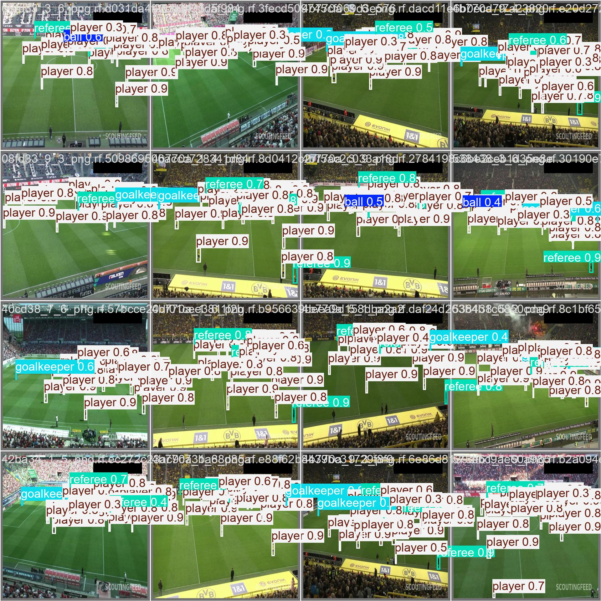

# Week 3: YOLOv8 Object Detection

UAVs@Berkeley ground-school homework: fine-tune YOLOv8s to detect football players, goalkeepers, referees, and balls. Compare training duration and image resizing, then evaluate the selected model on the held-out test split.

The selected model achieved **0.843 mAP50 and 0.578 mAP50–95** on 25 test images. Balls remain the main weakness, with recall of 0.263 at the evaluator's reported operating point.

## Experiments

All training runs started from pretrained `yolov8s.pt`, using image size 800, batch size 16, and seed 0. Each row below reports the saved best checkpoint's validation result, not necessarily the final epoch. Scores are rounded as printed by the evaluator.

| Dataset preparation | Epochs | mAP50 | mAP50–95 | Ball AP50 | Ball recall |
|---|---:|---:|---:|---:|---:|
| Stretch to 640 × 640 | 25 | 0.814 | 0.528 | 0.417 | 0.269 |
| Stretch to 640 × 640 | 50 | **0.847** | **0.564** | **0.478** | **0.333** |
| Fit with black padding to 640 × 640 | 50 | 0.774 | 0.461 | 0.299 | 0.178 |

Longer training improved these validation scores. Preserving proportions with padding performed worse in this run. Padding leaves less image area occupied by the scene, potentially making small objects harder to detect; this explanation was not independently tested. Increasing model input size to 800 cannot recover detail already lost in a 640-pixel dataset export.

Changing the epoch budget also changes the learning-rate schedule and when mosaic augmentation stops (the last 10 epochs). This compares two training budgets, not an identical trajectory extended by 25 epochs. Each configuration was run once; differences have not been tested across multiple seeds.

## Data preparation and augmentation

Source: [Model Examples football dataset, version 2](https://universe.roboflow.com/model-examples/football-players-obj-detection/dataset/2), displayed by Roboflow as CC BY 4.0. Images and labels were supplied by that dataset, not collected or annotated by me. Result previews are derived from those images.

- 298 training images, 49 validation images, and 25 test images.
- The source version used stretch resizing to 640 × 640 and no Roboflow augmentations.
- A fork (`yedil-abdiyev/football-players-obj-detection-nactr`, version 1, `fit-black-640`) used aspect-ratio-preserving fit with black edges at 640 × 640.
- The fork retained the displayed split counts; exact image-by-image split membership was not independently audited.
- Roboflow brightness changes of ±15% were previewed but not applied, to focus on resizing. Both versions had no additional Roboflow augmentations.
- YOLO's training-time augmentation remained enabled, including horizontal flips, color changes, and mosaic. Saved `args.yaml` files record settings.

## Final test evaluation

The stretched 50-epoch model was chosen from validation results, then evaluated on the original test split at image size 800. The log contains 25 images and 598 labeled objects.

| Class | Precision | Recall | AP50 | AP50–95 |
|---|---:|---:|---:|---:|
| Ball | 0.863 | 0.263 | 0.459 | 0.183 |
| Goalkeeper | 0.910 | 0.947 | 0.952 | 0.719 |
| Player | 0.955 | 0.979 | 0.988 | 0.777 |
| Referee | 0.937 | 0.946 | 0.972 | 0.634 |
| All (class averages) | 0.916 | 0.784 | 0.843 | 0.578 |

mAP summarizes detection performance across classes and confidence thresholds; it is not ordinary classification accuracy. AP50 uses an overlap threshold of 0.5, while AP50–95 averages stricter thresholds. The confusion-matrix counts can differ from reported precision/recall because their operating thresholds differ.

The test set is small and contains football footage. Frame similarity and match-level separation were not audited. Results do not establish performance on unrelated matches, UAV footage, or real-time onboard hardware. No deployment was performed.

## Reproduce

Open `week3_yolov8.ipynb` in Google Colab with a GPU runtime. It installs the recorded package versions, prompts privately for a Roboflow key, downloads the datasets, trains three configurations, and evaluates the selected checkpoint. Running all cells repeats training. The fork requires access; recreate its settings from the source if needed.

Recorded environment: Python 3.13.15, Ultralytics 8.2.103, Roboflow 1.1.48, PyTorch 2.11.0+cu128, Tesla T4. `requirements.txt` pins the two main packages but is not a complete environment lock. Installation produced conflicts with unrelated preinstalled Colab packages and an ImageCompression argument warning; imports and all reported runs nevertheless completed. A fresh runtime may need dependency troubleshooting.

This publication notebook was reorganized after the runs and its outputs cleared. The lost 50-epoch cell was reconstructed from the recorded command and settings. It has been structurally checked but has not been rerun end-to-end. Original experiment CSVs, settings, and plots are included as evidence. Final evaluation logs for the padded run and test were extracted from the submitted notebook; the other best-checkpoint summaries were transcribed from the recorded training logs. `results.csv` stores per-epoch values and may differ from best-checkpoint summaries.

## Files and saved weights

- `week3_yolov8.ipynb`: clean reproduction notebook without saved login outputs or deployment cells.
- `results/comparison.csv`: recorded experiment summaries.
- `results/baseline_25/`, `results/stretch_50/`, `results/fit_black_50/`: metrics, settings, and selected plots.
- `results/final_test/`: test log and selected plots/previews.

Model weights and dataset files are excluded from this source package. The selected model is `weights/best.pt` inside the separately saved `week3_50epochs.zip`. Keep that backup; weights can optionally be distributed through a GitHub Release. The other run backups are `week3_baseline.zip` and `week3_fit_black_640.zip`.
